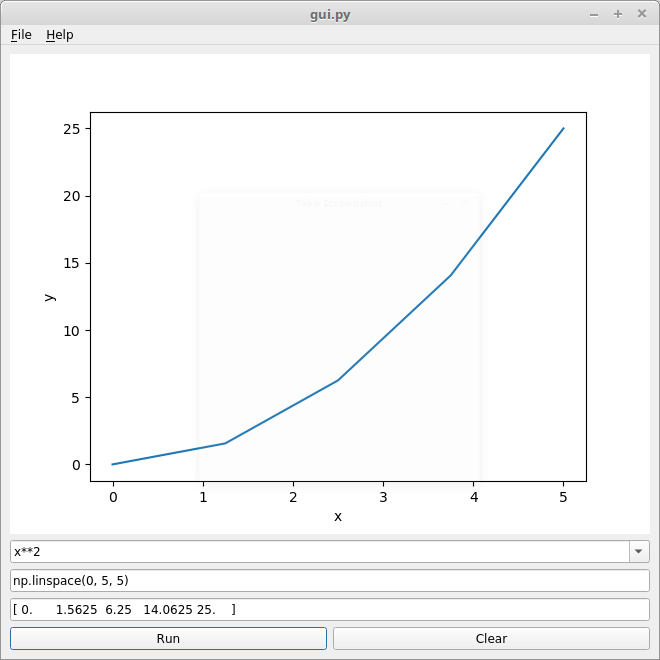

# ME 701 - Homework 7

For this homework, you will work individually to extend the GUI's developed
in class.  Your job is to create a *function evaluator* that has the
specific features indicated in each of the following problems.  A snapshot
of the final product is shown below, which you can use as a guide.

## Problem 1 - 2 points

During the first day, we developed a GUI with multiple text boxes that could
be connected using appropriate slots and signals.  You also were shown how
`exec` and `eval` are useful ways to define Python statements and expressions
using strings.  With these tools, develop a function evaluator that consists
of three widgets.  The first should be a *drop-down box* with three pre-loaded
functions.  A fourth, blank option should allow a user to enter any Python
expression that represents a function of `x`.  The second box should be the
value of `x` at which to evaluate the expression in the first box.  The third
box should be another text box that displays the value of the expression.
Finally, have two buttons under the boxes.  The left button should be to 
evaluate the function and update the plot.  The right button should clear
the output and the plot.  You may find that `QFormLayout` is of some use.

## Problem 2 - 2 points

Extend your GUI so that `x` can be a sequence of numbers of a NumPy expression.
 Specifically, 
allow the users to enter things like `0, 1, 2, 3` or `np.linspace(0, 1, 4)`
for `x`.  Moreover, you should provide a `save as` feature that
saves the `x` and `f(x)` data to file as two columns.

## Problem 3 - 2 points

During the third day, we saw how to plug into Matplotlib in order to 
embed plots in our GUI.  Your job is to create a function plotter by
combining your interface from problems 1 and 2 with .  You should 
ensure that plots can be refreshed for new $f$ or $x$ values.

